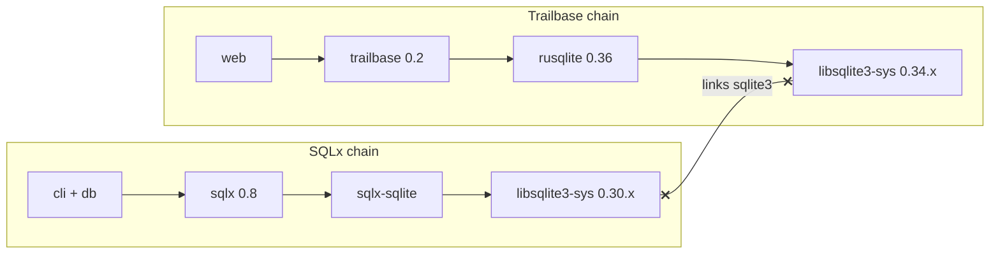

<!-- ee9873d6-663b-4226-a19c-0b0880bc39cf -->
---
todos:
  - id: "pick-strategy"
    content: "Choose: Trailbase 0.1, SQLx 0.9-alpha, or remove Trailbase"
    status: pending
  - id: "apply-toml"
    content: "Edit web/Cargo.toml and/or cli+db Cargo.toml per strategy"
    status: pending
  - id: "fix-web-run"
    content: "Fix web/src/lib.rs imports + Trailbase/Axum wiring after deps resolve"
    status: pending
  - id: "verify-tree"
    content: "cargo check + cargo tree -i libsqlite3-sys (single version)"
    status: pending
isProject: false
---
# Resolve `libsqlite3-sys` / `sqlite3` links conflict

## Root cause

- [`cli/Cargo.toml`](cli/Cargo.toml) and [`db/Cargo.toml`](db/Cargo.toml): `sqlx` with `sqlite` → `sqlx-sqlite` **0.8.x** → `libsqlite3-sys` **`^0.30.1`** (only 0.30.x).
- [`web/Cargo.toml`](web/Cargo.toml): `trailbase = "0.2.0"` → `rusqlite ^0.36` → `libsqlite3-sys` **`^0.34.0`**.

Cargo allows only one crate with `links = "sqlite3"` in the graph ([resolver rules](https://doc.rust-lang.org/cargo/reference/resolver.html#links)). These requirements do not intersect, so resolution fails.

## Recommended fix (smallest dependency churn): align on Trailbase 0.1

**[`crates.io` trailbase 0.1.0](https://crates.io/crates/trailbase/0.1.0)** depends on **`rusqlite ^0.33`**, which in turn depends on **`libsqlite3-sys ^0.30.1`**—the same line as `sqlx-sqlite` 0.8.6. That should yield a **single** `libsqlite3-sys` in the workspace.

1. In [`web/Cargo.toml`](web/Cargo.toml), set `trailbase` to **`0.1`** (or pin `0.1.0` if you want exact reproducibility).
2. Run `cargo check` (or `cargo update -p trailbase` then check). Confirm with `cargo tree -i libsqlite3-sys` (one version).
3. **API drift:** Trailbase 0.1 vs 0.2 may differ (e.g. `Server`, `ServerOptions`, `DataDir`). Adjust [`web/src/lib.rs`](web/src/lib.rs) to match the 0.1 API or refactor.

**Note:** [`web/src/lib.rs`](web/src/lib.rs) currently calls `Server::init_with_custom_initializer`, `ServerOptions`, `DataDir`, and a closure `AppState` **without any `use trailbase::...`**, and the destructured `main_router` / `admin_router` are unused while `serve` uses `app` from `routes::init_routes`. After deps resolve, this file still needs correct imports and a coherent merge of Trailbase’s router/TLS with your Axum `app` (or removal of the Trailbase block if you only wanted plain Axum).

## Alternative A: Upgrade SQLx (heavier)

**[`sqlx` 0.9.0-alpha.1](https://crates.io/crates/sqlx)** uses `sqlx-sqlite` with `libsqlite3-sys` **`>=0.30.0, <0.36.0`**, which **includes 0.34.x**, so it can coexist with `rusqlite` 0.36 / Trailbase 0.2.

Tradeoffs:

- **MSRV:** that alpha declares **Rust 1.86.0+**.
- **Features:** TLS feature names changed (e.g. `tls-rustls` → `tls-rustls-ring-webpki` / related variants per 0.9 README).
- **Stability:** alpha; possible breaking changes vs 0.8.

Update `sqlx` in **both** [`cli/Cargo.toml`](cli/Cargo.toml) and [`db/Cargo.toml`](db/Cargo.toml), align features, run `sqlx migrate` / offline data if you use them, and fix compile errors.

## Alternative B: Remove Trailbase

If Trailbase was experimental: remove the `trailbase` dependency from [`web/Cargo.toml`](web/Cargo.toml), delete the `Server::init_with_custom_initializer` block from [`web/src/lib.rs`](web/src/lib.rs), and serve `routes::init_routes(app_state)` directly (your pre-Trailbase shape). No sqlite conflict from Trailbase.

## What not to rely on

- **`[patch]`** forcing one `libsqlite3-sys` across incompatible semver ranges will either fail resolution or break one of `sqlx-sqlite` / `rusqlite` at compile time.
- **Splitting the workspace** works but is usually worse than aligning versions unless you have a strong reason to isolate crates.

## Verification

After any approach: `cargo check` at workspace root, then `cargo tree -i libsqlite3-sys` should show a **single** package version.
